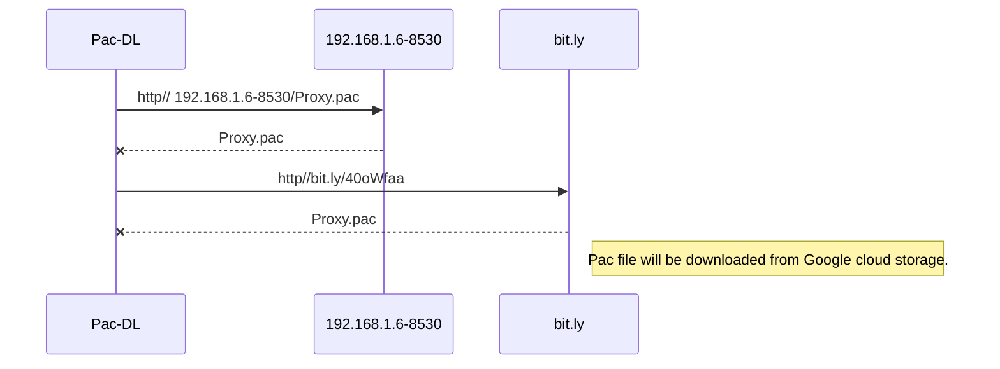

# Proxy-Simulation
This project is collection of tools which assist simulation of proxy setup at home. 
Proxy setup consist of majorly 3 entities
- HTTP Server which Host Auto PAC file
- Proxy Server itself 
- Mobile App

## PAC File hosting Internet server
PAC file can be hosted over internet in any media hosting HTTP/HTTPS or it can be hosted locally on subnet
- Internet Hosting 
PAC file can be hosted on **Google Cloud Storage** with Public to internet permission enabled


```
Public accessible URL can be like **https://storage.googleapis.com/emmagents/proxy.pac**
Above link can be shorten using bit.ly (http://bit.ly/40oWfaa)
```
## PAC file hosting locally 
PAC file can be hosted locally using a simple python server (requires python3)
- Step 1: Create a folder anywhere in PC (c:\ProxyPac)
- Step 2: Place a sample PAC file inside this folder (say Proxy.pac)
- Step 3 :go to cmd prompt c:\ProxyPac and execute 
> python -m http.server --bind 192.168.1.6 8530
> - Provide IP address of your local machine
> - 8530 is local port where this server listens

**Sequence Diagram for PAC Download**


## Proxy Server Setup
You have choice of 2 freely available Proxy server (on Windows environment) 
- CCProxy 
- Charles Proxy (limited to run only 30 minutes)
