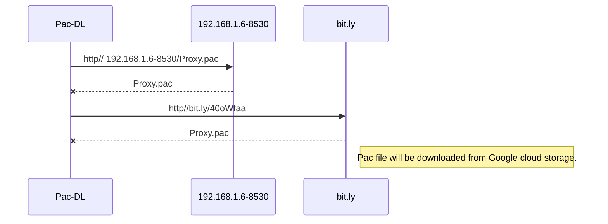
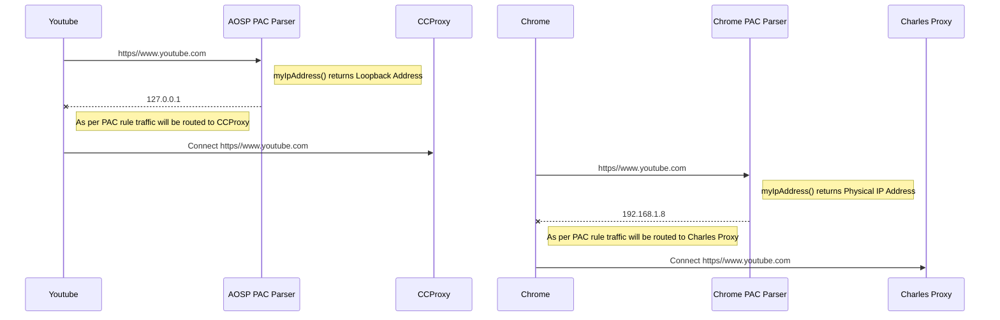

# Proxy-Simulation
This project is collection of tools which assist simulation of proxy setup at home. 
Proxy setup consist of majorly 3 entities
- HTTP Server which Host Auto PAC file
- Proxy Server itself 
- Mobile App

## PAC File hosting Internet server
PAC file can be hosted over internet in any media hosting HTTP/HTTPS or it can be hosted locally on subnet
- Internet Hosting 
PAC file can be hosted on **Google Cloud Storage** with Public to internet permission enabled


```
Public accessible URL can be like **https://storage.googleapis.com/emmagents/proxy.pac**
Above link can be shorten using bit.ly (http://bit.ly/40oWfaa)
```
## PAC file hosting locally 
PAC file can be hosted locally using a simple python server (requires python3)
- Step 1: Create a folder anywhere in PC (c:\ProxyPac)
- Step 2: Place a sample PAC file inside this folder (say Proxy.pac)
- Step 3 :go to cmd prompt c:\ProxyPac and execute 
> python -m http.server --bind 192.168.1.6 8530
> - Provide IP address of your local machine
> - 8530 is local port where this server listens

**Sequence Diagram for PAC Download**



## Proxy Server Setup
You have choice of 2 freely available Proxy server (on Windows environment) 
- CCProxy 
- Charles Proxy (limited to run only 30 minutes)

**CCProxy Setup**
CCProxy should be configured to run on **Port 3080**


**Charles Proxy Setup**
Charles Proxy should be running on **Port 8888**


## Sample PAC file Configuration
``` 
function FindProxyForURL(url, host)
{
  local_ip = myIpAddress();
  alert ('myip proxy - ' + local_ip);
  
  if (myIpAddress()	== "127.0.0.1")
	return "PROXY 192.168.1.6:3080";
  if (isInNet(myIpAddress(), "192.168.1.0", "255.255.255.0")) 
	return "PROXY 192.168.1.6:8888";
 
  return "DIRECT"
}
```
**Interpretation**
> **myIpAddress()** function returns the IP address of the machine which is making a HTTP connection, in this case its mobile device

```
if (myIpAddress()=="127.0.0.1") ==> if IP adress returned is **LoopBack** then
>return "PROXY 192.168.1.6:3080"; ==> Redirect HTTP Traffic to **CC Proxy**
```
```
if (isInNet(myIpAddress(), "192.168.1.0", "255.255.255.0"))  ==> if IP adress returned is **Physical** then
>return "PROXY 192.168.1.6:8888"; ==> Redirect HTTP Traffic to **Charles Proxy**
```
```
return "DIRECT" ==> if IP is not LoopBack or not in the range of Subnet then Bypass Proxy
```
## **Sequence Diagram for Proxy Redirect**
- **myIpAddress()** behavior is different in AOSP Pac lib and Chrome Pac lib, Once Proxy PAC is applied each and every HTTP/S traffic from Device will be routed according to PAC file, basically from above example every HTTP/S request will be routed to either CCProxy or Charles Proxy according to value returned by myIpAddress()
> - AOSP Pac lib myIpAddress() always return LoopBack adress 
> - Chrome Pac lib myIpAddress() always return Physical IP of the device

```
Note: Application such as YouTube, Gmail, Maps or application based on WebView, OKHTTP etc always uses AOSP provided Pac Parser
Browser such as Chrome, Mozzilla, Firefox use their own implemenation of PAC processing and return Physical IP address when enquired by myIpAddress()
```


     
